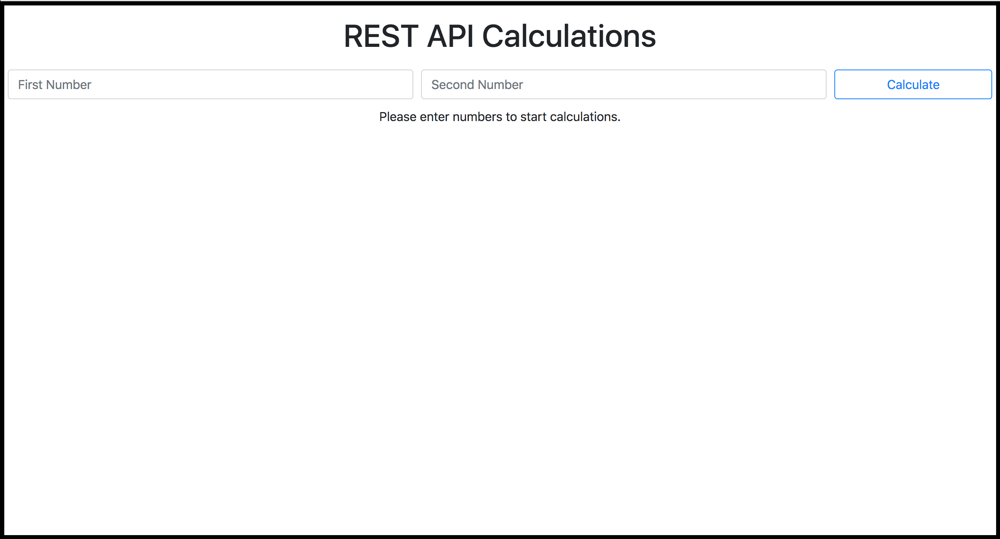
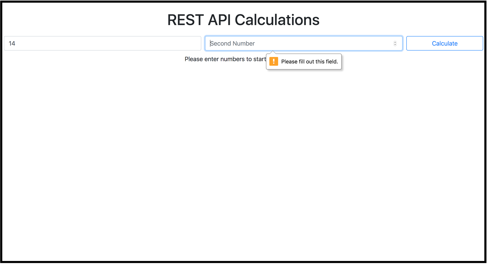
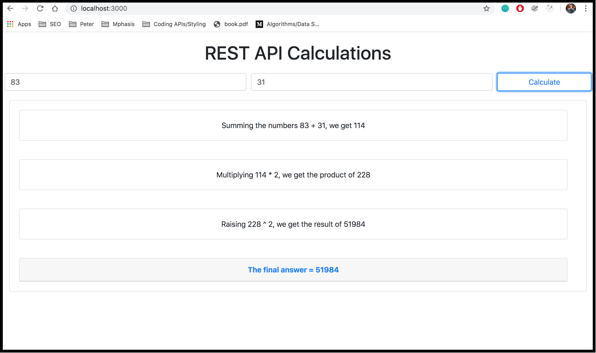

# React-Node-Express-MySQL RESTful Calculations
Utilizing React, Node, Express, and MySQL, this project used REST API calls to insert and update data in a database. 

## Installation - MySQL Setup

As noted by the title of this project, we are using MySQL as the database in this project.

I am using MacOS for my working environment, but here are the links I used to download and install MySQL and MySQL Workbench.

Click here to install: [MySQL Community Server](https://dev.mysql.com/downloads/mysql/), [MySQL Workbench](https://www.mysql.com/products/workbench/)

## Connection - MySQL Setup

To ensure that the connection between MySQL and Express works, we need to edit the index.js file

You need to make sure that your host, user, password, and database configurations are updated to your system's MySQL configuration OR you can create the exact same MySQL environment as mine. 


Additionally, if you would like to have the same database that I used (column names, datatypes, etc.) you can copy and paste this into your MySQL Workbench and execute the query. 

```bash
CREATE TABLE `calculations` (
  `id` int NOT NULL AUTO_INCREMENT,
  `first_num` double DEFAULT NULL,
  `second_num` double DEFAULT NULL,
  `sum_result` double DEFAULT NULL,
  `product_result` double DEFAULT NULL,
  `power_result` double DEFAULT NULL,
  PRIMARY KEY (`id`)
) ENGINE=InnoDB AUTO_INCREMENT=59 DEFAULT CHARSET=utf8mb4 COLLATE=utf8mb4_0900_ai_ci
```

## Installation - Node.js Server and React Development Environment

Clone the Github repo using:

```bash
git clone https://github.com/alexlarcheveque/React-Node-Express-MySQL-RESTCalculations.git
```

Make sure you have Node.js installed, we need to import our packages and to open our react application and server.

Click here to download Node.js: [Node.js](https://nodejs.org/en/download/)

Once we have our Github repo cloned and Node.js installed, we can get the project up and running. In the Github repo, we use two folders in this project, Express-Node-MySQL and React-App, that will be running simultaneously. Follow the respective directions down below for each folder.

### Express-Node-MySQL Start

In your terminal, open the Folder Express-Node-MySQL. Make sure the packages Express, CORS, MySQL, and Nodemon are installed on your system using npm.

```bash
npm install --save-dev nodemon
npm install express --save
npm install cors --save
npm install mysql --save
```
After these packages are installed, start the node server 

```bash
nodemon index.js
```

Your Node server should be running on port 3306, while your REST API calls can be made on http://localhost:4000.

### React-App Start

Create another terminal instance and open the folder React-App.

Start the react development server by executing the following.

```bash
npm start
```

## Example (Screenshots)

This is our home page when the react server starts. As stated, a user user is prompted to enter two numbers. 



Our form includes form validation. It will check for the following cases:

1. When a user enters anything besides an integer or a float (ex: a, b, c, etc.)
2. When a user doesn't fill out all required inputs 




After a user inputs proper numbers, and clicks "Calculate," the application makes the REST API calls and also shows the results of the calculations:



Here we can see the updated MySQL table with the newly inputted calculations:


I decided to make one table, instead of seperate tables, with the columns "first_num", "second_num", "sum_result", "product_result", and "power_result" because this was the most clear for self-documentation. 

Each column has a purpose, and is easily readable from a first-time user's perspective.
